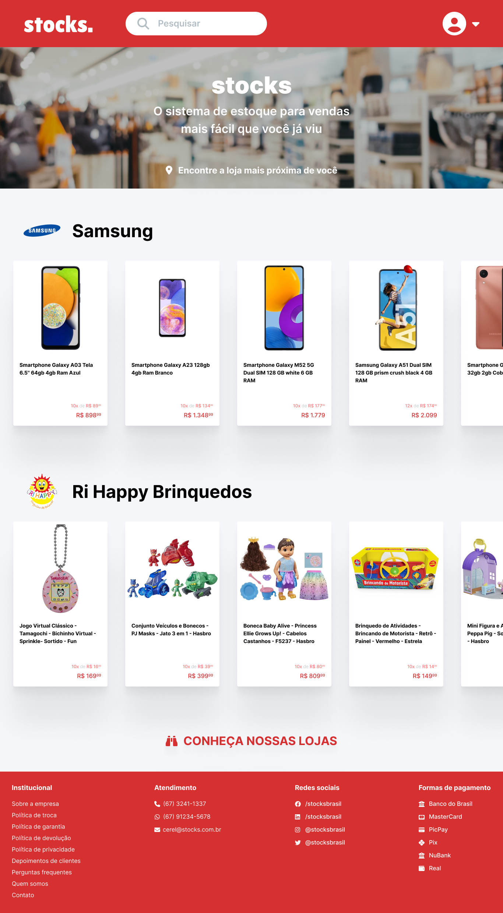

# stocks

## Sumário

- [stocks](#stocks)
  - [Sumário](#sumário)
  - [Motivação](#motivação)
  - [Time](#time)
  - [Pilha de tecnologia](#pilha-de-tecnologia)
  - [Galeria](#galeria)

## Motivação

Este foi o primeiro repositório de código apresentado no [Curso Superior de TSI do IFMS](https://www.ifms.edu.br/campi/campus-aquidauana/cursos/graduacao/sistemas-para-internet/sistemas-para-internet) como requisito para obtenção da nota parcial de uma atividade da unidade curricular Engenharia de Software I, a qual consistiu em desenhar um protótipo visual de alta fidelidade com base em um [documento de requisitos de software](./docs/2022-2-tsi-30715-engenharia-de-software-i-stocks-doc-requisitos.pdf) redigido pelo meu time de discentes, também formado para esta atividade.

A atividade supracitada consistiu em uma dinâmica na qual a turma foi autodividida em times e cada time propunha uma proposta de software, além de _desenvolver_ a proposta de software do time consecutivo. Respeitando a ementa da unidade curricular Engenharia de Software I do [PPC do Curso Superior de TSI](https://www.ifms.edu.br/centrais-de-conteudo/documentos-institucionais/projetos-pedagogicos/projetos-pedagogicos-dos-cursos-de-graduacao/projeto-pedagogico-do-curso-superior-de-tecnologia-em-sistemas-para-internet-campus-aquidauana.pdf) (vide página 44), o _desenvolvimento_ da proposta de software se limitou a entrevistar os discentes do time consecutivo representando os Donos do Produto, redigir um documento de requisitos de software, desenhar as respectivas interfaces de usuário e simular a técnica Planning Poker em sala de aula. Isto posto, **não** houve desenvolvimento de software, no que concerne à escrita de código-fonte, nesta unidade curricular.

## Time

- [Iury F. da Rocha](https://github.com/Iury2022/)
- [Inês E. C. Ribeiro](https://github.com/INESEUSTAQUIO2022/)
- Matheus D. C. Comparotto G.

## Pilha de tecnologia

As seguintes tecnologias foram utilizadas para desenvolver este app:

| Papel | Tecnologia |
|-|-|
| Prototipagem | [Figma](https://figma.com/) |

Os modelos de dados, a coleta de requisitos e os créditos pelas mídias utilizadas estão disponíveis [aqui](./assets/README.md).

## Galeria

